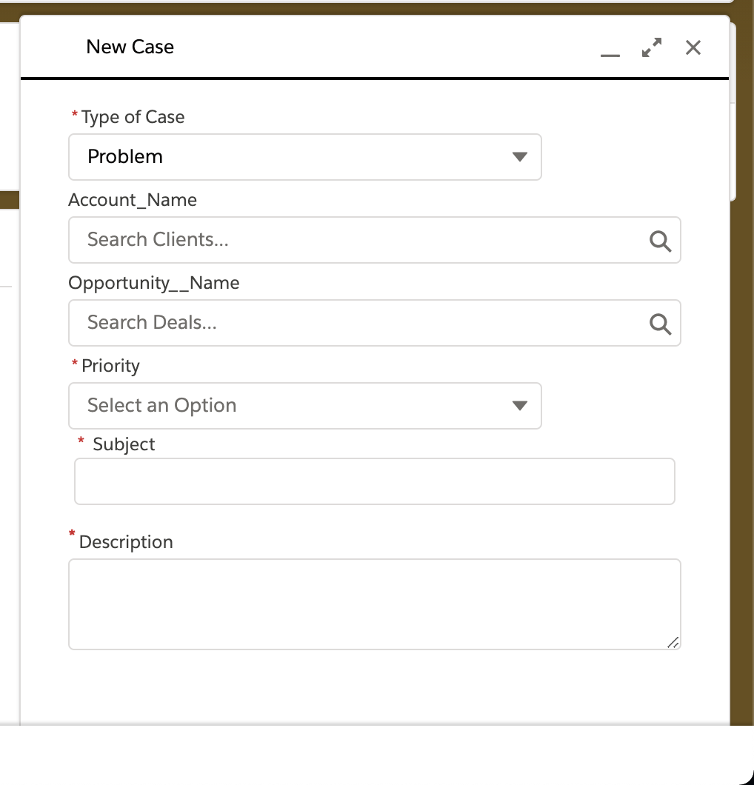
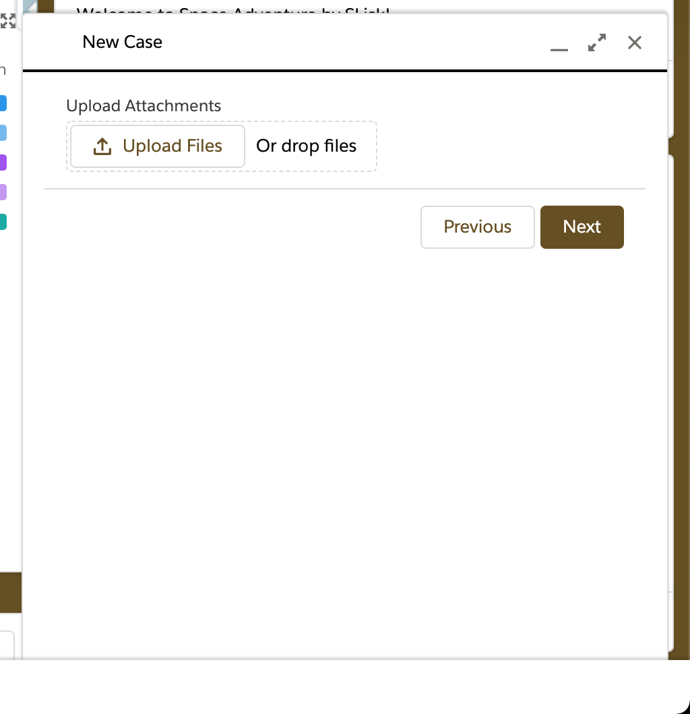

# New Case Flow Lightning Component

This repository houses my Lightning Aura Component, which I created to call a Screen Flow via a Global Action.

The Flow creates a new Case with lookup field visibility dependent on the value of the Type field. It also includes a File Upload component to allow attachment of screenshots.

The field visibility is a condition of the QuickChoice Component from Alex Edelstein's FlowBasePacks on UnofficialSF.

## Preqrequisites
- Enable MyDomain

## Usage

## Credits

- alexed1, [FlowActionsBasePack](https://github.com/alexed1/LightningFlowComponents/tree/master/flow_action_components/FlowActionsBasePack)
- alexed1, [FlowScreenComponentsBasePack](https://github.com/alexed1/LightningFlowComponents/tree/master/flow_screen_components/FlowScreenComponentsBasePack)
- Jennifer Lee, [How to Invoke a Flow from a Global Action](https://jenwlee.com/2018/05/08/invoke-a-flow-from-a-global-action/)

## Documentation

- [Salesforce Lightning Design System Documentation](https://www.lightningdesignsystem.com/)
